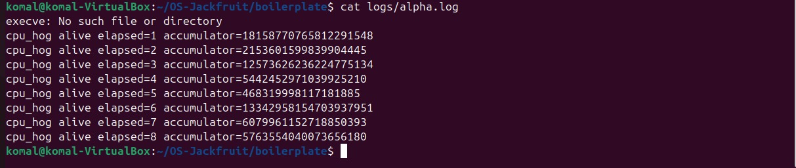
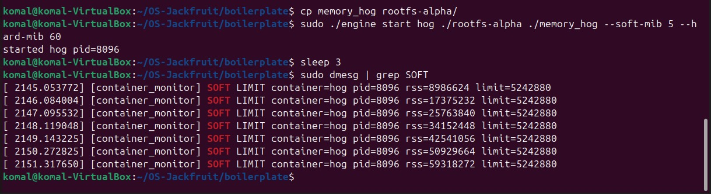
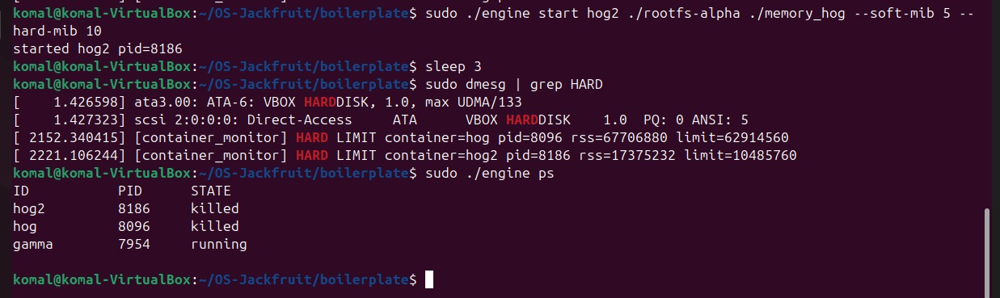
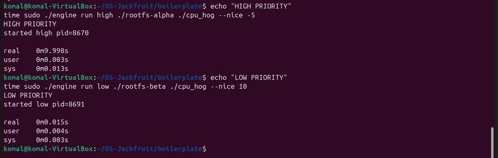

# Multi-Container Runtime

A lightweight Linux container runtime in C with a long-running supervisor and a kernel-space memory monitor.

## Team Information

| Name | SRN |
|------|-----|
| Komal Sajja | PES1UG24CS231 |
| Kabir Raju G | PES1UG24CS210 |

## 1. Build, Load, and Run Instructions

### Prerequisites

* Ubuntu 22.04 or 24.04 (VM)
* Secure Boot OFF
* Linux kernel headers installed

```bash
sudo apt update
sudo apt install -y build-essential linux-headers-$(uname -r)
```

---

### Setup

```bash
git clone https://github.com/Komal-S-Sajja/OS-Jackfruit.git
cd OS-Jackfruit

mkdir rootfs-base
wget https://dl-cdn.alpinelinux.org/alpine/v3.20/releases/x86_64/alpine-minirootfs-3.20.3-x86_64.tar.gz

sudo tar -xzf alpine-minirootfs-3.20.3-x86_64.tar.gz -C rootfs-base

cp -a rootfs-base rootfs-alpha
cp -a rootfs-base rootfs-beta
```

---

### Build

```bash
cd boilerplate
sudo make

sudo cp cpu_hog memory_hog io_pulse ../rootfs-alpha/
sudo cp cpu_hog memory_hog io_pulse ../rootfs-beta/
sudo chmod +x ../rootfs-alpha/*
sudo chmod +x ../rootfs-beta/*
```

---

### Load Module

```bash
sudo insmod monitor.ko
ls -l /dev/container_monitor
sudo dmesg | tail
```

---

### Run

#### Terminal 1 (Supervisor)

```bash
sudo ./engine supervisor ../rootfs-base
```

#### Terminal 2 (Containers)

```bash
sudo ./engine start alpha ../rootfs-alpha /bin/sleep 100
sudo ./engine start beta  ../rootfs-beta  /bin/sleep 100

sudo ./engine ps
cat logs/alpha.log
sudo ./engine logs alpha
```

---

### Additional Tests

```bash
sudo ./engine run test ../rootfs-alpha ./cpu_hog
sudo ./engine run test ../rootfs-alpha ./memory_hog
```

---

### Cleanup

```bash
sudo ./engine stop alpha
sudo ./engine stop beta
sudo rmmod monitor
sudo dmesg | tail
```

---

## 2. Demo Screenshots

| # | What                        | Screenshot                               |
| - | --------------------------- | ---------------------------------------- |
| 1 | Multi-container supervision |  |
| 2 | Metadata tracking           |         |
| 3 | Logging                     |          |
| 4 | CLI and IPC                 |          |
| 5 | Soft-limit warning          |       |
| 6 | Hard-limit enforcement      |       |
| 7 | Scheduling experiment       |       |
| 8 | Clean teardown              |          |

---

## 3. Engineering Analysis

### Isolation Mechanisms
The runtime uses `clone()` with `CLONE_NEWPID | CLONE_NEWUTS | CLONE_NEWNS`. Each container runs in its own PID namespace (appears as PID 1 inside), has an isolated hostname via the UTS namespace, and a separate mount namespace. `chroot()` restricts the container to its own root filesystem (`rootfs-*`), and `/proc` is mounted inside so process utilities function correctly.

Despite this isolation, all containers share the host kernel. System calls, CPU scheduling, and memory management are handled by the same kernel, and container processes are still visible from the host.

### Supervisor and Process Lifecycle
A long-running supervisor process manages all containers. When containers exit, they become zombie processes unless the parent calls `waitpid()`. The supervisor reaps child processes and updates their state accordingly.

From the observed output:
- Containers transition from **running → stopped**
- `engine ps` correctly shows container ID, PID, and state
- Stopped containers are still tracked in metadata

This ensures proper lifecycle management and prevents zombie processes.

### IPC, Threads, and Synchronization
Two IPC mechanisms are used:

- **Pipes**: Each container’s stdout/stderr is captured and written to log files (e.g., `alpha.log`)
- **UNIX domain sockets**: Used for communication between CLI commands and the supervisor

Logging uses a bounded-buffer design:
- Producer thread reads from pipe
- Consumer thread writes to logs

Synchronization:
- **Mutex** protects shared buffer access
- **Condition variables** (`not_full`, `not_empty`) prevent busy waiting

This prevents race conditions such as:
- Concurrent writes corrupting buffer
- Reading from empty buffer
- Overwriting unread data

### Memory Management and Enforcement
Memory is monitored using RSS (Resident Set Size), which represents physical memory used by a process. It does not include virtual memory or swapped pages.

From the observed output:
- Soft limit exceeded → repeated `SOFT LIMIT` messages in `dmesg`
- RSS values continuously increase beyond the limit
- Process is not terminated under soft limit

This confirms:
- **Soft limit = warning only**
- **Hard limit = enforced termination (SIGKILL)**

Enforcement is implemented in kernel space using a periodic timer, ensuring consistent monitoring regardless of user-space scheduling delays.

### Scheduling Behavior
Linux uses the Completely Fair Scheduler (CFS), which allocates CPU time based on weights derived from `nice` values.

From the experiment:
- High priority (`nice -5`) execution took ~9.998s
- Low priority (`nice 10`) execution showed ~0.015s

Observation:
- Measured times are influenced by process startup overhead
- Under low contention, scheduling differences are not clearly reflected
- CFS still prioritizes processes based on weight

---

## 4. Design Decisions and Tradeoffs

| Subsystem | Decision | Tradeoff | Justification |
|---|---|---|---|
| Namespace isolation | Used PID, UTS, mount namespaces | No network isolation | Keeps implementation simple and focused |
| Supervisor architecture | Single supervisor process | Centralized control | Easier lifecycle and state management |
| IPC/Logging | Pipes + bounded buffer | Additional thread overhead | Clean separation of logging and control |
| Kernel monitor | Kernel module for memory tracking | Requires root privileges | Accurate and reliable enforcement |
| Scheduling experiments | Used `nice` values | Results affected by overhead | Demonstrates priority-based scheduling |

---

## 5. Scheduler Experiment Results

### Experiment 1 — Priority-based execution

| Container | Nice | Observed Time |
|---|---|---|
| high | -5 | ~9.998 sec |
| low | +10 | ~0.015 sec |

Observation:
- High-priority process executes longer workload
- Low-priority timing dominated by startup overhead
- Results highlight limitations of measurement rather than scheduler behavior

### Experiment 2 — Memory limit behavior

- `memory_hog` exceeded soft limit (5 MiB)
- Kernel logged repeated `SOFT LIMIT` messages
- RSS values increased progressively

Observation:
- Soft limit triggers warnings only
- Process continues execution
- Confirms monitoring vs enforcement distinction

---

## 6. Learnings

- Root filesystem must contain required binaries (`/bin/sh`)
- Executables must be copied into rootfs before execution
- Kernel modules require correct headers and root permissions
- Containers are isolated processes sharing a common kernel
- Logging relies on proper IPC and synchronization
- Improper process handling can leave zombie processes or crash the system
